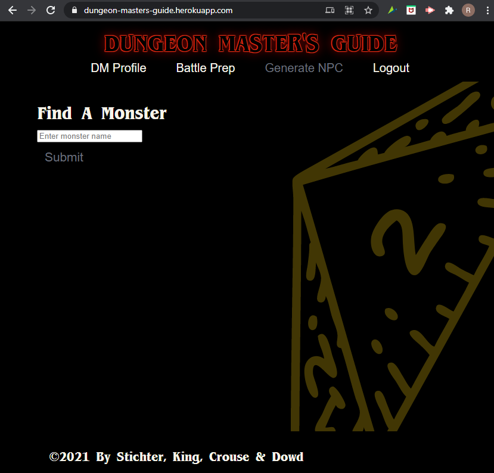
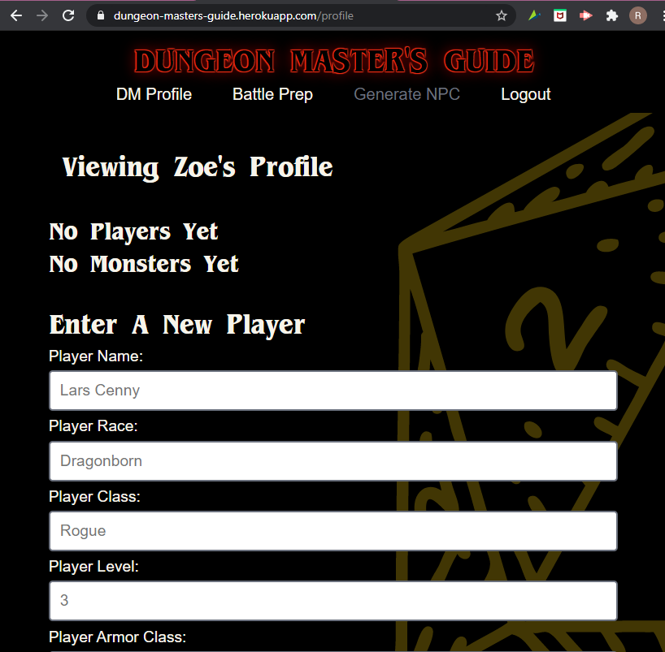
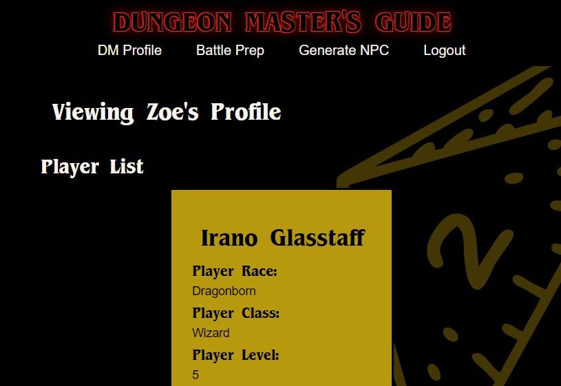
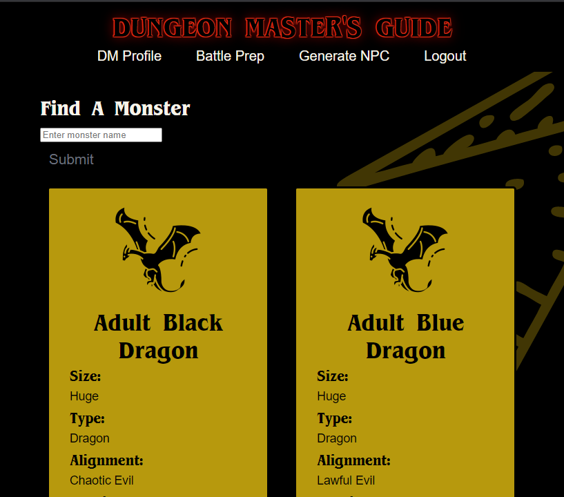
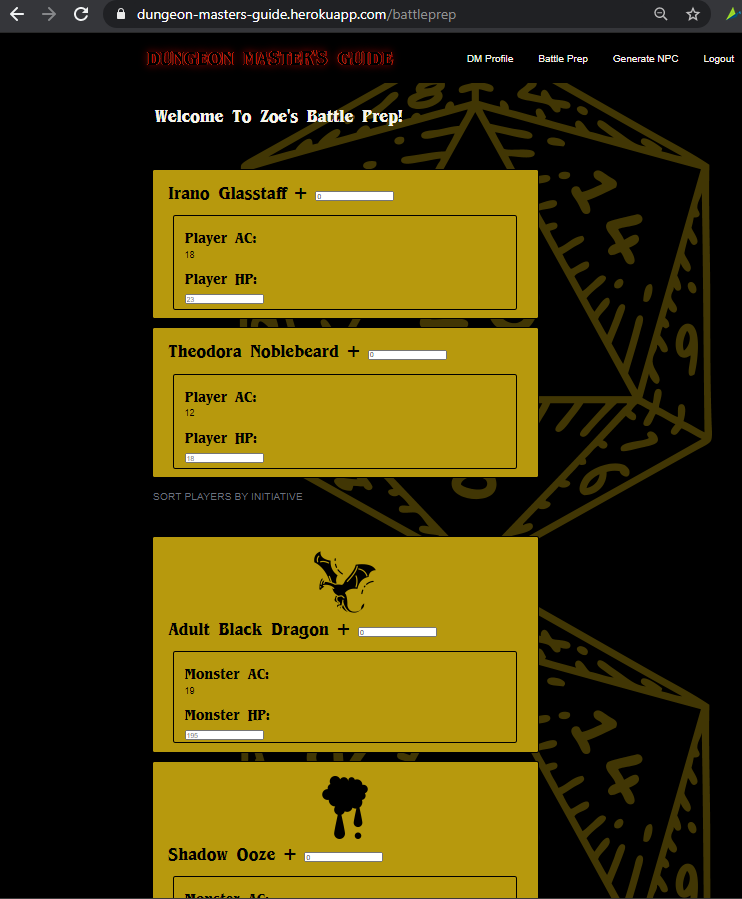
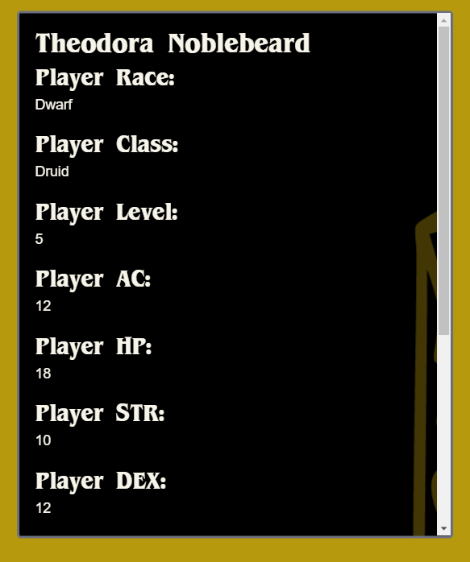
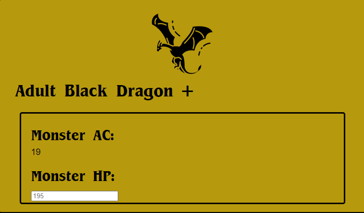

# Dungeon Master's Guide

[MIT](https://opensource.org/licenses/MIT)

## Description

Dungeon Master's Guide was developed as an interactive tool for the Dungeon Master (DM) to stay organized during battle and running a campaign.

“D&D is a collaborative storytelling game where one person plays the narrator and supporting cast while everyone else plays a main character”.

If you are not logged in, casual viewers can search monsters and their stats.

If you are logged in, the DM can enter their player characters, choose the monsters that the players will battle, track initiative (order of play) and the damage dealt to each player or monster.

As a bonus, if the DM is struggling to come up with a random character for their players to interact with they can check out the random NPC generator

## Table of Contents

* [Installation](#installation)
* [Usage](#usage)
* [KnownBugs](#knownbugs)
* [License](#license)
* [Contributors](#contributors)
* [Tests](#tests)
* [Questions](#questions)
        
## Installation

The deployed application can be accessed at [Dungeon Master's Guide](https://dungeon-masters-guide.herokuapp.com/).

## Usage

When you arrive at the homepage of the application you will see the the navigation bar at the top displaying for you to *Login* or *Signup*.  In this view you will be able to casually search for Monsters.  When you log in or create a DM, your view will display the following image.  Note that you are able to search for Monsters in this view as well.

  

Once you log in you will be able to navigate to your DM Profile,  which if this is your first log in, will not contain players or monsters.

  

You can add a player by filling out all of the fields in the `Enter A New Player` form.  When the page refreshes, you will see your new player!

  

If you navigate back to the main screen, you can add a monster!  Search and monster and click the save button at the bottom of the monster information card.

  

  

Always check back in your DM profile to see your players and monsters!

Once you are satisfied with your players and monsters, click on `Battle Prep` to prepare for and conduct battle.  In this view you will see that all of your players and monsters have been moved over to a compressed view.  Here you can enter the initiative (based on your dice roll) into the text box to the right of the player or monster name.  Once you have entered all initiative values, click the `SORT PLAYERS BY INITIATE` button at the bottom of the player and monster sections, respectively.

  

If you would like to reference back on your player or monster data, click the plus next to their name.  This will open a modal with information from the DM profile regarding the creature.

  

Once you are ready to battle, keep track of the player and monster Hit Points by typing in the text box.

  

## KnownBugs

When you create a Dungeon Master (DM) through the signup page, you must enter a player or monster to your profile before you are able to add another DM.

## License

Copyright (c) sldowd. All rights reserved. 

        Licensed under the MIT license.

## Contributors

- [Rae Stichter](https://github.com/RaeStichter/)

- [Zoe King](https://github.com/zoeking1221/)

- [Matt Crouse](https://github.com/Mcrouse42)

- [Sarah Dowd](https://github.com/sldowd/)

## Tests

Application was tested during development using GraphQL Playground.

## Questions

Additional Questions? Reach out to all contributors through the section above or through the GitHub link below:

[View Github Repo](https://github.com/RaeStichter/initiate-dnd)
    